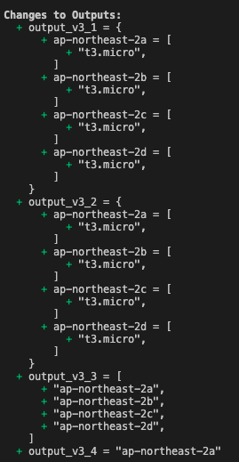

# 반복문 & 가정문

```markdown
CloudNet@ Gasida(가시다)님과 함께 5번째 온라인 스터디를 진행하고 있습니다. 
T101은 Terraform 스터디이며, Terraform Up & Running 책을 기반으로 진행하고 있습니다. 
```

## 내용 요약

### 반복문

`count` 대신 `for_each` 를 활용하자 !

- `count` 는 배열 인덱싱으로 테라폼 수정시 삭제와 생성이 진행된다!
- `count` 는 블록인덱싱 지원이 안된다!

### [과제1&2]

`목표` : 반복문&조건문을 활용해서 리소스(어떤 리소스든지 상관없음)를 배포해보고, 해당 코드를 Github 에 올려주세요.

목표 : 반복문 & 조건문이 포함되어 있는 리소스를 확인하고 이해하자
예제 리소스 : [https://github.com/HanHoRang31/terraform-on-aws-eks/tree/main/05-Terraform-Loops-MetaArguments-SplatOperator/05-04-for_each-with-az-instancetype-check](https://github.com/HanHoRang31/terraform-on-aws-eks/tree/main/05-Terraform-Loops-MetaArguments-SplatOperator/05-04-for_each-with-az-instancetype-check)


예제 내용 : 가용 AZ 내 인스턴스(t3.micro) 운영 가능 여부 확인 및 출력문 확인

data.filter를 통해 조건 선별(opt-in-status, instance-type, location) 

1) for_each 

```markdown
data "aws_ec2_instance_type_offerings" "my_ins_type" {
  for_each = toset(data.aws_availability_zones.my_azones.names)
  filter {
    name   = "instance-type"
    values = ["t3.micro"]
  }
  filter {
    name   = "location"
    values = [each.key]
  }
  location_type = "availability-zone"
}
```

- toset 은 key와 value와 동일하다

2) 가용 AZ 내 인스턴스(t3.micro) 운영 가능 여부 확인

```markdown
output "output_v3_2" {
  value = {
    for az, details in data.aws_ec2_instance_type_offerings.my_ins_type: 
    az => details.instance_types if length(details.instance_types) != 0 }
}
```

- `az` : data 필터로 적용된 가용 AZ
- `details.instance_types` : 가용 인스턴스 확인

가용 인스턴스 이름의 길이가 0이 아닌 것을 조건으로 가용 영역과 가용 인스턴스를 MAP으로 저장한다.

출력 확인

```markdown
➜ terraform init
➜ terraform plan
```

 

