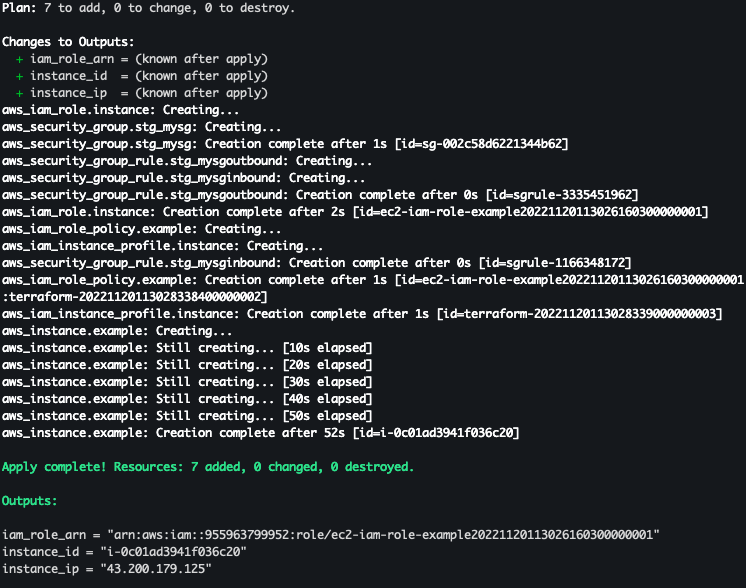
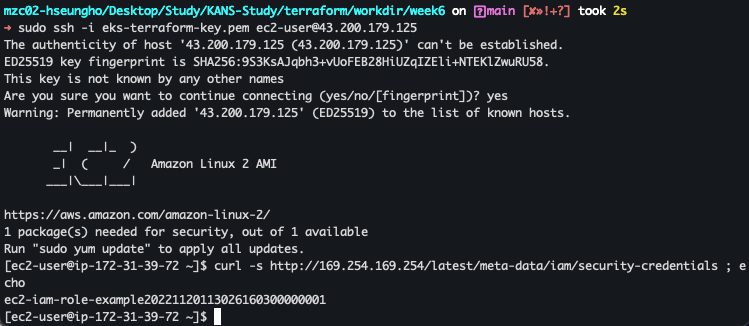
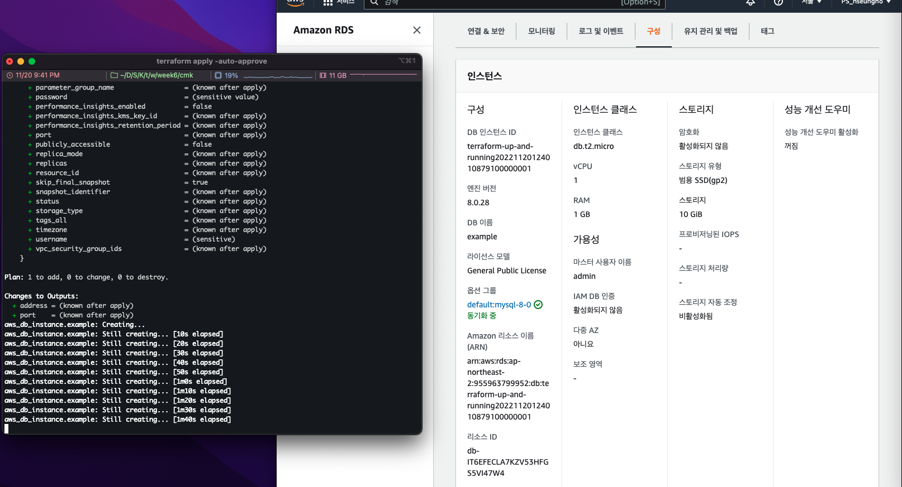

# ls -Secret Management Basics

```
CloudNet@ Gasida(가시다)님과 함께 6번째 온라인 스터디를 진행하고 있습니다. 
T101은 Terraform 스터디이며, Terraform Up & Running 책을 기반으로 진행하고 있습니다. 
```

`목적`  : 배포 과정에서 민감 정보 관리가 필요함 → 평문으로 절대 하지말 것! 비밀번호 관리 도구가 필요하다!

`목표` : 각자 편하게 **민감정보를 안전하게 관리하는 테스트**를 해보고 관련 **스샷**을 올려주세요!


### 테스트

[1] [Providers] IAM role 발급을 통한 EC2 접근 테스트






[2] [Resources and data sources] Secret stores - AWS Secreets Manager 를 통한 자격 증명 저장 테스트

